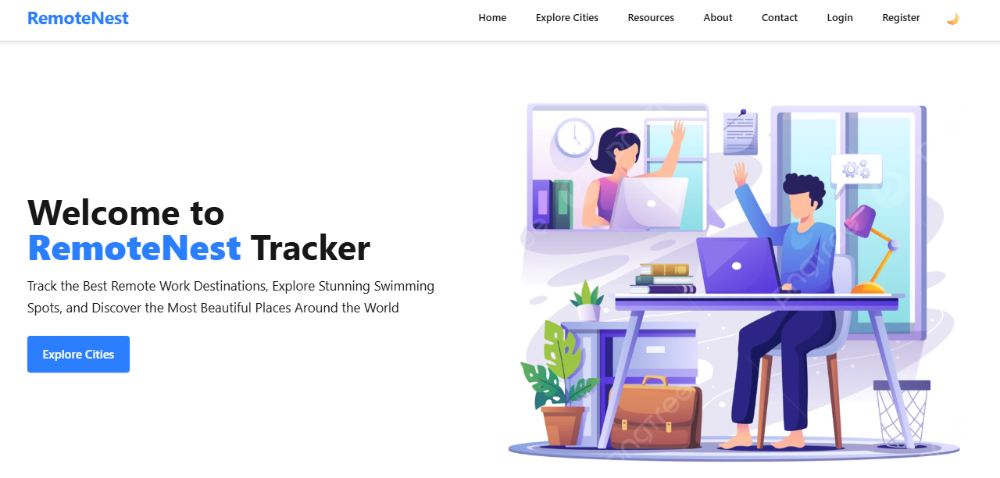

<!-- REQUIRED FOR PINNED CARDS -->
<meta property="og:image" content="https://raw.githubusercontent.com/mdsabir07/remotenest_frontend/main/.github/SOCIAL_PREVIEW.png">
<meta name="twitter:image" content="https://raw.githubusercontent.com/mdsabir07/remotenest_frontend/main/.github/SOCIAL_PREVIEW.png">

# 🏝️ RemoteNest - A Platform for Digital Nomads

> **A Full-Stack Next.js platform for digital nomads** to discover, book, and manage remote-friendly stays worldwide.

---

## 🌍 Overview

**RemoteNest** is a full-stack web application for **digital nomads** to explore global cities, book remote-friendly accommodations, and share travel stories.  
It combines the power of **Next.js (App Router)**, **NextAuth**, and **MongoDB** to deliver a seamless, secure, and dynamic user experience.

🔗 **Live Demo:** [https://remotenest.vercel.app](https://remotenest.vercel.app)

---

## 🚀 Key Features

### 👩‍💻 User Features
- Discover **remote-friendly cities** with lifestyle and cost insights  
- View city details with pricing, availability, and location info  
- Create and publish **blog posts** to share experiences  
- Book accommodations with dynamic price calculation  
- Manage your bookings and status in real time  

### 🛡️ Admin Dashboard
- Approve or reject user-submitted cities and blog posts  
- Manage accommodation bookings  
- Review and moderate platform activity  

### 🔔 Notification System
- Instant notifications for key user actions:
  - New booking requests  
  - Admin approvals/rejections  
- Built using a modular **Mongoose model** and server utilities  

---

## 🧠 Highlights

✅ Built on **Next.js 15 App Router** for optimized routing  
✅ Secure **NextAuth.js** authentication with JWT  
✅ **Role-based access control (RBAC)** for users and admins  
✅ Modular and reusable **API architecture**  
✅ Fully responsive **UI** built with TailwindCSS & Framer Motion  
✅ **SEO-optimized** pages for faster indexing  
✅ Deployed seamlessly on **Vercel**

---

## 🛠️ Tech Stack

| Layer | Technologies |
|-------|---------------|
| **Frontend** | Next.js, React, TailwindCSS, Framer Motion |
| **Backend** | Node.js, Next.js API Routes |
| **Database** | MongoDB with Mongoose |
| **Auth** | NextAuth.js (Credentials + JWT) |
| **UI Library** | ShadCN/UI, SweetAlert2 |
| **Deployment** | Vercel |
| **Version Control** | Git & GitHub |

---

## 📁 Folder Structure

/app
├── api/ # API routes for blogs, cities, bookings, notifications
├── cities/ # City listing & details
├── blog/ # Blog CRUD and detail pages
├── components/ # Shared UI components
/lib
├── authOptions.js # NextAuth configuration
├── mongodb.js # DB connection
├── sendNotification.js # Utility for in-app notifications
/models
├── User.js
├── City.js
├── BlogPost.js
├── Booking.js
└── Notification.js

---

## ⚙️ How It Works

1. **Users** register/login securely using **NextAuth.js**  
2. **Users** can submit new cities, write blogs, and book accommodations  
3. **Admins** review & approve submissions and bookings  
4. **Notifications** update users in real time  

---

## 🧩 Future Enhancements

- 💳 **Stripe** payment integration  
- 🤖 **AI-powered travel assistant chatbot**  
- 🌐 Multi-language support  
- 📊 Admin analytics dashboard  

---

## 🧭 Keywords for SEO

`Next.js`, `NextAuth`, `MongoDB`, `Mongoose`, `TailwindCSS`, `React`, `Full-Stack Developer`,  
`Remote Work Platform`, `Digital Nomads`, `Vercel Deployment`, `Framer Motion`, `MERN`, `App Router`

---

## 📄 License

Licensed under the **MIT License** — you’re free to use and modify this project for personal or educational purposes.

---

## 👨‍💻 Author

**Sabirul Islam**  
Full-Stack Developer | WordPress & Next.js Specialist  

💼 [Portfolio](https://sabir-portfolio-2a4b1.web.app/)   
🐙 [GitHub](https://github.com/mdsabir07)

### 🌐 **Let's Connect**

---

⭐ **If you like this project, don’t forget to star the repo!**